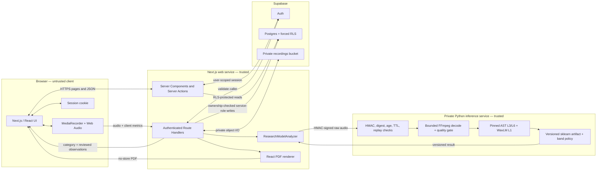
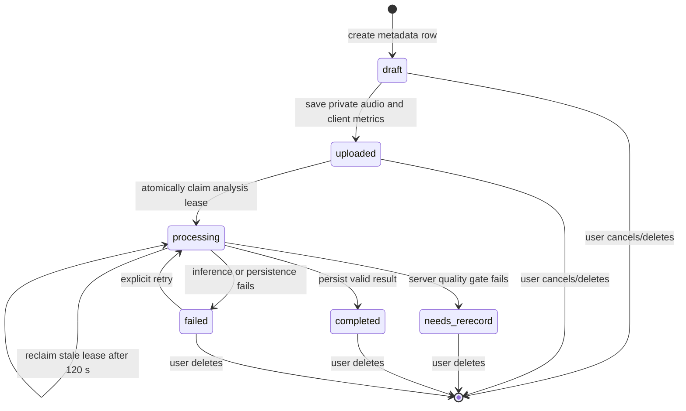

# SoundCue architecture

SoundCue has two deployable applications and one managed data platform:

- A Next.js web application for the UI, authentication flow, screening lifecycle, and reports.
- A private Python/FastAPI service for research-model inference.
- Supabase Auth, Postgres, Row Level Security, and private Storage.

The browser is untrusted. Only the Next.js server may use the Supabase service role, and only the two trusted services know the inference HMAC secret.

## System diagram

## Component responsibilities

| Area | Primary paths | Responsibility |
| --- | --- | --- |
| App routes and pages | `src/app/` | Navigation, server rendering, auth actions, API Route Handlers, error/legal pages |
| Feature UI | `src/features/` | Recording, analysis progress, results, clinician reports, history, account controls |
| Shared UI | `src/components/` | Layout, branding, disclaimer, consent, authentication, common controls |
| Domain and infrastructure | `src/lib/` | Audio features/quality, analyzer adapters, Supabase clients, auth/consent, deletion, result copy |
| Shared contracts | `src/types/screening.ts` | Screening states, analyzer input/output, database shape, browser-safe view |
| Database and storage | `supabase/migrations/` | Schema, constraints, RLS, grants, private bucket, rate limits, processing lease |
| Inference API | `model-service/soundcue_inference/` | Request authentication, audio decoding, quality gates, encoder extraction, scoring |
| Model provenance | `model-service/model_manifest.json` | Approved model/version/hash, encoder revisions, preprocessing, thresholds, evidence |
| Automated checks | `src/**/*.test.*`, `model-service/tests/`, `supabase/tests/`, `tests/e2e/` | Unit, API, model, database policy, browser, and accessibility coverage |

## Deployment boundaries

The web and inference services are deliberately separate deployments. The public web service receives browser traffic. The inference service should accept traffic only from the trusted web service and exposes no model endpoint directly to the browser.

The web service owns:

- session validation and consent enforcement;
- same-origin checks on mutations;
- screening creation, upload finalization, analysis claims, and deletions;
- database rate-limit calls;
- user-facing result shaping and PDF generation.

The inference service owns:

- request signature, content digest, timestamp, request ID, and age verification;
- bounded decoding of untrusted browser audio;
- server-side recording-quality validation;
- exact encoder/model loading and artifact verification;
- component scoring, weighted combination, categories, and contextual observations.

## Data boundaries

### Browser-visible application result

`ScreeningView` intentionally omits `user_id`, `recording_path`, the browser-extracted `features` object, and the internal `score`. For research sessions, the user-facing response includes a categorical band, reviewed findings/observations, quality status, and provenance versions.

### User-owned Postgres data

`profiles`, `consent_events`, and `screenings` use forced RLS. Authenticated users may read only their own rows. Browser-role writes are narrow: users can append their current consent and update only the sound-cue preference. Screening lifecycle mutations are performed by Route Handlers after authenticating the user and rechecking row ownership.

### Service-role-only model data

`screening_model_outputs` stores the ensemble score, three component scores, technical metrics, and inference duration. `analysis_runs` stores a coarse operational audit state. Both tables revoke access from anonymous and authenticated browser roles.

### Private recording objects

Recordings use the object path `userId/screeningId/source.ext` in the private `recordings` bucket. The web upload path enforces an application limit of 4 MiB and a narrow browser-audio MIME allowlist. App playback downloads only an owned recording and returns it with private, `no-store` headers.

## Screening state machine

Database functions make rate-limit consumption and processing claims atomic. A completed research screening is constrained to have its service-role-only model-output row before the categorical screening row can enter `completed`.

## Security controls in the design

- Supabase sessions are refreshed and validated with `auth.getUser()`.
- Mutating Route Handlers reject cross-site requests and return `no-store` responses.
- Every service-role query is preceded by authenticated-user and ownership checks.
- Inference requests include an exact-body SHA-256 digest and HMAC-SHA256 signature over the timestamp, request ID, age, normalized MIME type, and digest.
- The inference service rejects stale, future-dated, tampered, replayed, oversized, unsupported, and malformed requests.
- The model artifact is hashed before deserialization, and the web service independently checks the returned approved artifact hash.
- Research scores never appear on the browser-readable screening result.
- Screening deletion removes the private object before its database row; account deletion removes retained objects before deleting the Auth user.

See [How SoundCue works](HOW_IT_WORKS.md) for the full request sequence and [Setup](SETUP.md) for local deployment of each component.
