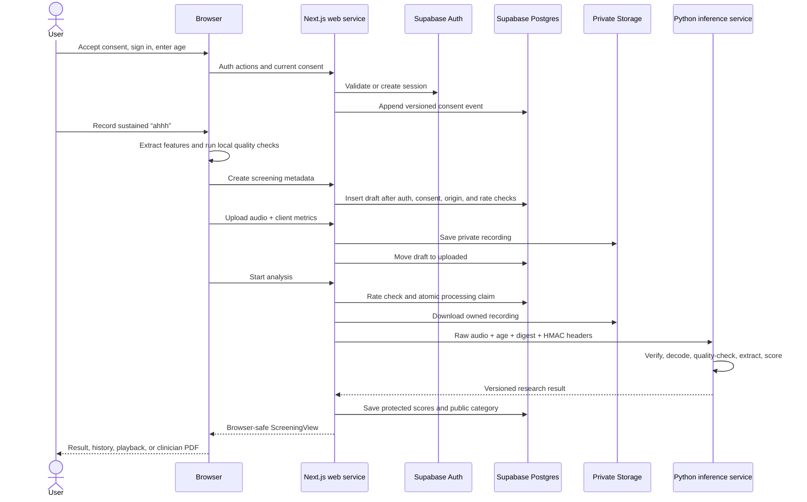

# How SoundCue works

SoundCue turns a short sustained-vowel recording and the user's age at screening into a categorical research result. The pipeline is intentionally split so the browser can record and review audio without receiving model internals, while trusted services control persistence and inference.

SoundCue is a screening aid, not a diagnostic system. Its categories are positions within an internal development reference, not disease probabilities.

## End-to-end request sequence



## 1. Consent and authentication

The landing page requires affirmative consent before a screening begins. SoundCue records consent against `CONSENT_DOCUMENT_VERSION`; consent events are append-only for the lifetime of the account.

If Supabase is configured, Server Actions provide email/password signup, sign-in, password reset, and optional Google OAuth. A short-lived signed cookie carries consent through authentication, and the consent event is persisted after a user session exists. The session-refresh proxy calls Supabase `auth.getUser()` so server code works with a validated identity rather than trusting unverified cookie contents.

If Supabase is not configured in development, the app uses an explicit, non-persistent preview path.

## 2. Browser recording and first quality gate

The user enters an integer age from 18 through 85 for each screening. Age is stored with that screening, not copied to the account profile.

The recorder requests a mono microphone stream with echo cancellation, noise suppression, and automatic gain control disabled. It uses:

- `MediaRecorder` to create the uploadable browser-audio blob;
- Web Audio PCM samples to draw the live waveform;
- local feature extraction to measure duration, input level, voiced coverage, clipping, pitch behavior, jitter, shimmer, and breath support.

After a three-count lead-in, recording must continue for at least five seconds, targets six seconds, and stops automatically at seven seconds. The user can listen and record again. “Use this recording” remains disabled when the local checks detect a short, silent/quiet, interrupted, or clipped recording.

This local gate improves feedback speed and avoids needless uploads. It is not the authoritative research quality gate; the inference service independently decodes and evaluates the received bytes.

## 3. Draft creation and private upload

Accepting a recording triggers two authenticated requests.

First, `POST /api/screenings`:

1. rejects cross-site mutations;
2. validates the Supabase user and current consent version;
3. consumes the database-backed creation rate limit;
4. validates age, duration, MIME type, and size;
5. inserts a `draft` screening row.

Second, `POST /api/screenings/{id}/complete`:

1. authenticates the user and checks screening ownership;
2. accepts only a draft row;
3. validates the audio and strict client-feature schema;
4. compares the declared metadata with the actual upload;
5. writes the object to `userId/screeningId/source.ext` in private Storage;
6. atomically updates the row to `uploaded` with its object path and client metrics.

If the database finalization fails after storage succeeds, the handler removes the newly uploaded object to avoid an orphan.

## 4. Analysis claim and audit record

`POST /api/screenings/{id}/analyze` validates auth, ownership, consent, and stored input completeness. Completed and rerecord results are idempotently returned.

Before model work begins, the handler:

- consumes a separate database-backed analysis rate limit;
- calls `claim_screening_for_analysis`, which atomically changes `uploaded` or retryable `failed` rows to `processing`;
- allows a `processing` row to be reclaimed only after its 120-second lease becomes stale;
- inserts an `analysis_runs` audit row with a unique request ID and no identity, audio, feature, or result payload.

These operations prevent ordinary double submission and make retry behavior explicit.

## 5. Protected research-service call

`ResearchModelAnalyzer` downloads the private recording on the server and signs a request to `/v1/analyze`. The canonical HMAC message is:

```text
v1\n{timestamp}\n{requestId}\n{age}\n{normalizedMimeType}\n{bodySha256}
```

The request carries the raw audio body plus its timestamp, unique request ID, age, normalized MIME type, SHA-256 digest, and HMAC-SHA256 signature. The service rejects requests that are stale or too far in the future, have a reused request ID on the warm instance, contain a digest/signature mismatch, use a noncanonical age or unsupported MIME type, or exceed 4 MiB.

The web request has a 120-second timeout. Production configuration requires an HTTPS inference URL and fails closed when research mode or required secrets are missing.

## 6. Server-side audio pipeline

The Python service treats browser audio as untrusted input:

1. A bounded FFmpeg subprocess decodes at most eight seconds to mono 8 kHz float PCM and strips metadata.
2. The service measures duration, RMS level, voiced coverage, clipping, discontinuities, pitch movement, and loudness variation.
3. The versioned thresholds in `model_manifest.json` reject unsuitable recordings before encoder execution.
4. Valid audio is resampled to 16 kHz for the encoders.
5. Purpose-pruned, revision-pinned encoder checkpoints produce three frozen views:
   - AST layer 3 distillation token;
   - AST layer 6 token mean, token standard deviation, CLS token, and distillation token;
   - WavLM layer 1 mean across valid frames, using a fixed 7.5-second input shape.

The model service verifies the checked-in sklearn artifact's SHA-256 before deserializing it and verifies that its version agrees with the manifest.

## 7. Scoring and category construction

Age is prepended independently to each of the three encoder feature vectors. Each fitted component produces a raw output that is mapped through its frozen empirical calibration reference. The calibrated component scores are combined with fixed weights:

- AST layer 3: 40%
- AST layer 6: 40%
- WavLM layer 1: 20%

Frozen thresholds map the weighted position to `fewer`, `some`, or `more` detected patterns. This position is not a probability.

The service also derives four categorical observations: agreement among model views, pitch steadiness, loudness stability, and sound continuity. The three audio observations compare deterministic measurements with the internal development reference. They provide recording context and are not causal explanations of the embedding model.

The response includes schema, model, preprocessing, band-policy, and artifact versions so the caller can reject an unexpected or stale model result.

## 8. Persistence and browser-safe result shaping

The analysis handler validates the entire service response and independently compares its artifact hash with `SOUNDCUE_MODEL_ARTIFACT_SHA256`.

It then separates the result:

- `screening_model_outputs` receives the ensemble score, three component scores, technical metrics, and inference duration. Only the service role can access this table.
- `screenings` receives the categorical band, reviewed findings/observations, quality status, completion time, and provenance versions. Its research `score` column remains null.
- `analysis_runs` is finalized with status, coarse duration, analyzer version, or a non-sensitive error code.

`toScreeningView()` further removes the user ID, private object path, client feature object, and score from application responses.

## 9. Results, history, playback, and reports

The result screen converts the category and observation codes into reviewed, non-diagnostic language. History includes completed sessions and groups comparable research sessions by the same band-policy version.

Authenticated endpoints provide:

- owned recording playback with private, `no-store` response headers;
- a single-session clinician PDF;
- a multi-session trend PDF built only from eligible research sessions.

PDFs are generated on demand with selectable vector text. They include model/version provenance, evidence limitations, observations, and the screening disclaimer.

## 10. Failures, retries, and deletion

If authoritative quality checks fail, the screening becomes `needs_rerecord` and the UI returns the user to recording. Inference, configuration, timeout, or persistence failures move the screening to `failed`; retained audio remains available for an explicit retry.

Deleting a screening removes its Storage object before deleting its database row. If object removal fails, row deletion does not proceed. Permanent account deletion requires a sign-in within the previous 15 minutes, removes all retained recording objects, and then deletes the Supabase Auth user; database rows cascade from that user deletion.

No application log path is intended to include email addresses, audio bytes, extracted features, model results, object paths, access tokens, or generated PDF content.

## Development-only analyzers

`ANALYZER_MODE=dummy` selects a deterministic local analyzer only outside production. It exercises the web lifecycle without running the research encoders. When Supabase is absent, the UI preview calculates a browser-only placeholder result and persists nothing.

Neither path is comparable with research sessions, and production throws unless `ANALYZER_MODE=research` is fully configured.

See the [architecture diagram](ARCHITECTURE.md) for component and trust boundaries, and [setup instructions](SETUP.md) for running each mode.
